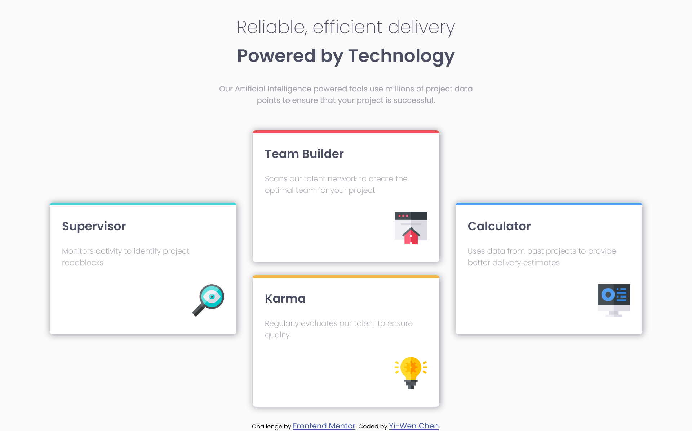

# Frontend Mentor - Four card feature section solution

This is a solution to the [Four card feature section challenge on Frontend Mentor](https://www.frontendmentor.io/challenges/four-card-feature-section-weK1eFYK). Frontend Mentor challenges help you improve your coding skills by building realistic projects. 

## Table of contents

- [Overview](#overview)
  - [The challenge](#the-challenge)
  - [Screenshot](#screenshot)
  - [Links](#links)
- [My process](#my-process)
  - [Built with](#built-with)
  - [What I learned](#what-i-learned)
  - [Continued development](#continued-development)
  - [Useful resources](#useful-resources)
- [Author](#author)


## Overview

### The challenge

Users should be able to:

- View the optimal layout for the site depending on their device's screen size

### Screenshot



### Links

- Solution URL: [Github](https://github.com/CHEN-YiWen/Four-card-feature-section)
- Live Site URL: [Live site host by Github](https://chen-yiwen.github.io/Four-card-feature-section/)

## My process

### Built with

- Semantic HTML5 markup
- CSS custom properties
- Flexbox

### What I learned

- <code>display: flex</code> is really powerful. I can recreate the disired layout I want fast.

- At first I could not make the two cards in the middle responsive. It turned out that I put them into <code><div class=center></code> so I needed to assign width to the whole div instead of the two cards.
```html
<div class="function">
      <section class="box1">
        ...
      </section>
      <div class="center">
        <section class="box2">
          ...
        </section>
        <section class="box3">
          ...
        </section>
      </div>
      <section class="box4">
       ...
      </section>
</div>
```
```css
.box1, .center, .box4{
        width: max(23rem);
    }
```

- Taking note and creating comments by using <code>/* */</code>is useful when it comes to reviewing my codes. Sometimes I am not sure about certain code or the layout I create, I will comment on them. It is way easier to find them once I signle them out. As my mother tongue is Mandarin, I used Mandarin in this challenge. Next time, I will chnage it into English so that people on this platform can still understand what those comments are about.😅


### Continued development

- I am afriad that the html isn't semantic enough. I will have to go through the code agian and chang it.

- It is quick to create the layout by using <code>display: flex</code>. However, I realize that I can not make the cards into a 2*2 column for smaller screen (500px to 950px). Just like [@vcarames]'s(https://vcarames.github.io/Four-Card-Layout/) design.
 
(Vcarames' design is really impressive! You should check it out!)
Although they used <code>display: grid</code> for this challenge, I believe it is possible to create the same 2*2 column by using <code>disp;ay: flex</code>. I think the reason why I can't achieve that maybe has something to do with my html code.

- Once I get the hang of <code>display: flex</code>, I would like to try learn how to create the simailiar layout in <code>display: grid</code>.


### Useful resources

- [box-shadow](https://developer.mozilla.org/zh-TW/docs/Web/CSS/box-shadow) - This helped me to understand how to set up proper box shadow. 


## Author

- Frontend Mentor - [@CHEN-YiWen](https://www.frontendmentor.io/profile/CHEN-YiWen)

